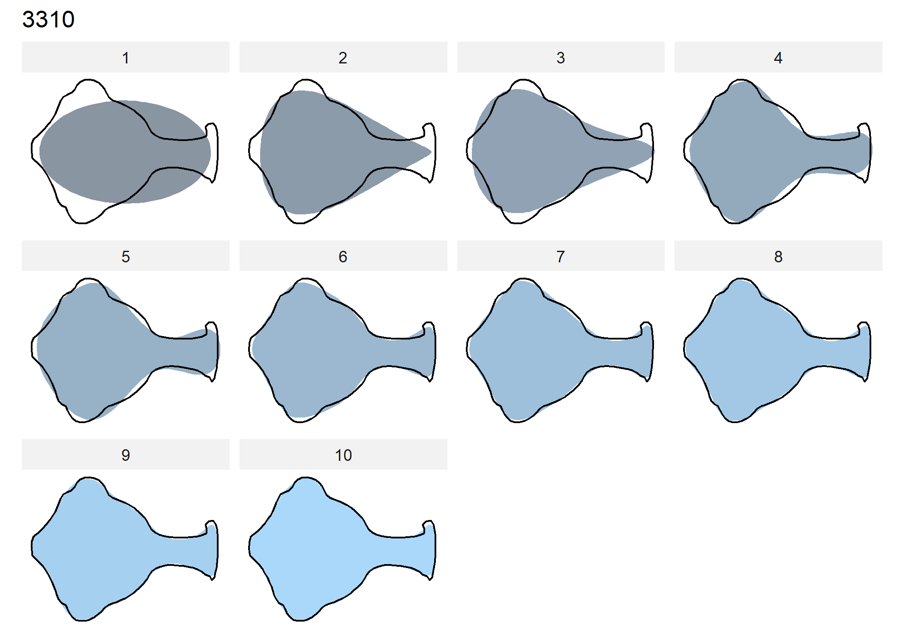

Aryballoid shape as a function of applique/burnishing?
================
Robert Z. Selden, Jr.
25 September, 2020

# Elliptical Fourier Analysis

## Load packages + data

``` r
# load packages
library(here)
```

    ## here() starts at D:/github/aryballoid

``` r
library(wesanderson)
library(Momocs)
```

    ## 
    ##   Momocs is now retired and will no longer be maintained.
    ##   It is superseded by Momocs2 and more generally MomX ecosystem:
    ## 
    ##              <   https://momx.github.io   >

    ## 
    ## Attaching package: 'Momocs'

    ## The following object is masked from 'package:stats':
    ## 
    ##     filter

``` r
# read images
jpg.list <- list.files(here("/jpegs"), full.names = TRUE)

# read attribute data
att.data <- read.csv("att.csv", header = TRUE, as.is = TRUE)

# attribute to factor
att.data$museum <- as.factor(att.data$museum)
att.data$burnish <- as.factor(att.data$burnish)
att.data$applique <- as.factor(att.data$applique)
```

## Generate outlines

``` r
# generate outlines
outlines <- jpg.list %>%
  import_jpg()
```

    ## Extracting 21.jpg outlines...

    ## [ 1 / 21 ]  1608-119.jpg
    ## [ 2 / 21 ]  1608-71.jpg
    ## [ 3 / 21 ]  1608-96.jpg
    ## [ 4 / 21 ]  1654-9.jpg
    ## [ 5 / 21 ]  1894.jpg
    ## [ 6 / 21 ]  2502.jpg
    ## [ 7 / 21 ]  2503.jpg
    ## [ 8 / 21 ]  2504.jpg
    ## [ 9 / 21 ]  3019.jpg
    ## [ 10 / 21 ]  3020.jpg
    ## [ 11 / 21 ]  3310.jpg
    ## [ 12 / 21 ]  4081.jpg
    ## [ 13 / 21 ]  4938.jpg
    ## [ 14 / 21 ]  5091.jpg
    ## [ 15 / 21 ]  5092.jpg
    ## [ 16 / 21 ]  5099.jpg
    ## [ 17 / 21 ]  5118.jpg
    ## [ 18 / 21 ]  5135.jpg
    ## [ 19 / 21 ]  5136.jpg
    ## [ 20 / 21 ]  7072.jpg
    ## [ 21 / 21 ]  X-49.jpg

    ## Done in 7.1 secs

``` r
# add attributes
data.out <- Out(outlines, 
         fac = att.data)

# scale, align, rotate, and center specimens
norm.outlines <- data.out %>% 
  coo_scale() %>%
  coo_align() %>% 
  coo_center()
```

## Pile and mosaics

``` r
# outline pile
pile(norm.outlines)
```


``` r
# mosaic - appliqued or not
mosaic(norm.outlines, ~applique)
```


``` r
# mosaic - burnished or not
mosaic(norm.outlines, ~burnish)
```


## Calibrate harmonic + EFA

``` r
# calibrate how many harmonics needed
calibrate_harmonicpower_efourier(norm.outlines, 
                                 nb.h = 30)
```

    ## $gg


    ## 
    ## $q
    ##                h1       h2       h3       h4       h5       h6       h7
    ## 1608-119 69.38344 81.41188 87.69178 91.11546 92.02808 95.11205 98.46218
    ## 1608-71  69.72250 82.17123 92.58869 95.46598 96.05776 96.61619 96.75033
    ## 1608-96  77.03519 82.04425 88.17779 89.85570 91.76579 96.98991 98.58157
    ## 1654-9   63.11254 75.29537 91.72624 95.10327 96.77940 97.87472 97.91685
    ## 1894     62.32898 72.41298 92.93447 96.19795 97.34025 98.13623 98.75732
    ## 2502     59.31413 73.72288 93.27138 96.62992 97.78617 98.42962 98.48673
    ## 2503     67.59531 77.95163 92.03538 95.22966 96.92485 98.04803 98.54576
    ## 2504     65.60230 74.63131 93.61914 95.72449 97.14086 98.36091 98.54936
    ## 3019     65.23961 75.19373 91.14493 96.05621 97.27108 98.13493 98.37515
    ## 3020     39.18262 74.19786 81.29249 90.94139 96.63630 96.89271 97.69070
    ## 3310     68.26095 77.39265 92.45088 93.99973 97.48264 98.47425 98.81087
    ## 4081     76.44298 78.50799 86.62249 89.29586 95.61446 98.20660 98.66212
    ## 4938     61.81053 70.18320 86.88782 93.38387 95.93345 96.92895 97.05731
    ## 5091     75.74060 81.94429 89.32964 91.76262 93.41584 97.22499 98.88130
    ## 5092     74.46167 79.70177 89.05420 91.77469 94.48792 98.37713 99.07336
    ## 5099     70.87724 79.94132 90.11692 93.39339 94.46224 98.43361 98.91871
    ## 5118     74.69213 78.53218 88.98520 90.89353 94.40941 98.15036 98.94547
    ## 5135     70.63713 79.90677 87.63884 92.57726 93.74838 97.93299 98.85182
    ## 5136     63.98666 76.04915 84.17124 94.52330 97.38742 97.66002 98.28184
    ## 7072     57.47780 70.03277 90.45954 95.42259 96.46646 98.26425 98.40781
    ## X-49     73.44666 79.96079 91.02910 94.28318 96.19053 98.65354 98.77710
    ##                h8       h9      h10      h11      h12      h13      h14
    ## 1608-119 98.76337 99.18060 99.52495 99.57245 99.64613 99.66977 99.69597
    ## 1608-71  96.96701 98.05998 99.07963 99.43336 99.48540 99.50447 99.73114
    ## 1608-96  98.75020 99.09975 99.17327 99.45957 99.51986 99.57401 99.69380
    ## 1654-9   98.28869 98.51556 98.62185 99.64914 99.66985 99.69105 99.76304
    ## 1894     99.05258 99.18494 99.22517 99.73854 99.78171 99.83785 99.85904
    ## 2502     98.86617 98.90740 98.95516 99.70964 99.74127 99.75079 99.81948
    ## 2503     98.85938 98.95025 99.11050 99.60200 99.69239 99.74652 99.86779
    ## 2504     99.03623 99.05674 99.09623 99.76038 99.80077 99.82933 99.86828
    ## 3019     98.85702 98.87090 98.90540 99.65805 99.75363 99.77717 99.83464
    ## 3020     98.09519 98.39477 99.09055 99.28769 99.35858 99.38853 99.67108
    ## 3310     99.12216 99.31064 99.36368 99.61501 99.64971 99.79621 99.84286
    ## 4081     98.82869 98.96493 99.24576 99.25745 99.32064 99.65965 99.71683
    ## 4938     98.39813 98.43608 98.46830 99.53671 99.63958 99.64137 99.76336
    ## 5091     99.12450 99.28881 99.48409 99.63870 99.64452 99.67485 99.74595
    ## 5092     99.27316 99.32987 99.36352 99.53103 99.53281 99.56707 99.74215
    ## 5099     99.34581 99.39438 99.47528 99.62109 99.65048 99.66919 99.78774
    ## 5118     99.07371 99.24040 99.29628 99.45938 99.57524 99.66121 99.74337
    ## 5135     99.25570 99.25927 99.36935 99.56288 99.60786 99.64488 99.73911
    ## 5136     98.84477 99.22634 99.37938 99.55033 99.55254 99.67848 99.75488
    ## 7072     98.87448 99.04722 99.10775 99.63583 99.75140 99.82484 99.84700
    ## X-49     99.02657 99.30019 99.31091 99.57141 99.62462 99.74429 99.84085
    ##               h15      h16      h17      h18      h19      h20      h21
    ## 1608-119 99.77048 99.79665 99.90127 99.92278 99.93602 99.94994 99.95324
    ## 1608-71  99.83334 99.89728 99.92299 99.93092 99.94292 99.94822 99.95353
    ## 1608-96  99.74375 99.80312 99.87331 99.89677 99.94065 99.94321 99.94811
    ## 1654-9   99.78294 99.80052 99.80900 99.88257 99.90249 99.95504 99.96119
    ## 1894     99.86896 99.88873 99.89284 99.95317 99.95777 99.97713 99.98168
    ## 2502     99.84070 99.85338 99.85919 99.92085 99.93930 99.95824 99.96155
    ## 2503     99.89306 99.89770 99.91646 99.93366 99.94159 99.95025 99.97421
    ## 2504     99.88985 99.90952 99.91432 99.95546 99.97142 99.98702 99.98742
    ## 3019     99.85478 99.86280 99.86584 99.88733 99.91328 99.94993 99.96743
    ## 3020     99.71941 99.83859 99.88602 99.89348 99.92826 99.94774 99.96776
    ## 3310     99.84872 99.86738 99.89140 99.90408 99.90825 99.94931 99.95755
    ## 4081     99.75813 99.85856 99.87195 99.87868 99.92150 99.93004 99.94239
    ## 4938     99.78549 99.83478 99.84747 99.86843 99.92889 99.95969 99.96529
    ## 5091     99.79415 99.85926 99.90687 99.91834 99.96214 99.96683 99.97188
    ## 5092     99.81916 99.90245 99.90705 99.90929 99.91375 99.94074 99.94996
    ## 5099     99.87143 99.92840 99.93961 99.94133 99.94428 99.95077 99.97322
    ## 5118     99.86371 99.90927 99.91763 99.92169 99.92520 99.94542 99.96337
    ## 5135     99.83502 99.87739 99.90467 99.91229 99.91884 99.92166 99.95808
    ## 5136     99.78122 99.86013 99.90377 99.90641 99.91487 99.92703 99.96696
    ## 7072     99.85108 99.86298 99.90637 99.92873 99.93747 99.95788 99.96445
    ## X-49     99.89179 99.90005 99.92527 99.93225 99.93333 99.95649 99.96571
    ##               h22      h23      h24      h25      h26      h27      h28 h29
    ## 1608-119 99.96112 99.96977 99.97916 99.98381 99.98950 99.99453 99.99809 100
    ## 1608-71  99.96653 99.97150 99.97456 99.97522 99.97792 99.98783 99.99770 100
    ## 1608-96  99.94970 99.95858 99.97705 99.98124 99.98760 99.99355 99.99784 100
    ## 1654-9   99.96608 99.96726 99.96965 99.98350 99.98957 99.99439 99.99742 100
    ## 1894     99.98194 99.98618 99.98751 99.99260 99.99300 99.99773 99.99880 100
    ## 2502     99.97075 99.97092 99.97251 99.98596 99.99233 99.99728 99.99845 100
    ## 2503     99.98218 99.98355 99.98956 99.99181 99.99359 99.99548 99.99607 100
    ## 2504     99.98883 99.99168 99.99261 99.99512 99.99839 99.99913 99.99952 100
    ## 3019     99.97262 99.97634 99.97906 99.97954 99.98599 99.99112 99.99395 100
    ## 3020     99.97357 99.98784 99.99221 99.99514 99.99532 99.99592 99.99856 100
    ## 3310     99.96282 99.98248 99.98327 99.98660 99.98905 99.99317 99.99656 100
    ## 4081     99.96530 99.96849 99.97821 99.99074 99.99421 99.99509 99.99757 100
    ## 4938     99.96853 99.97151 99.97545 99.97959 99.99292 99.99528 99.99760 100
    ## 5091     99.97274 99.97542 99.97861 99.98092 99.98509 99.98776 99.99448 100
    ## 5092     99.95860 99.97436 99.97880 99.99031 99.99522 99.99621 99.99754 100
    ## 5099     99.97766 99.97916 99.99362 99.99651 99.99838 99.99867 99.99890 100
    ## 5118     99.96653 99.97376 99.98838 99.99265 99.99639 99.99752 99.99816 100
    ## 5135     99.96973 99.97504 99.98792 99.99373 99.99432 99.99682 99.99857 100
    ## 5136     99.97876 99.97999 99.98865 99.99626 99.99751 99.99812 99.99869 100
    ## 7072     99.96617 99.96861 99.97740 99.98582 99.99385 99.99789 99.99948 100
    ## X-49     99.97312 99.98498 99.99080 99.99144 99.99350 99.99602 99.99808 100
    ## 
    ## $minh
    ##   90%   95%   99% 99.9% 
    ##     4     6    10    18

``` r
# 10 harmonics needed to capture 99 percent of variation
calibrate_reconstructions_efourier(norm.outlines, 
                                   range = 1:10)
```



``` r
# generate efa outlines with 10 harmonics
efa.outlines <- efourier(norm.outlines, 
                         nb.h = 10, 
                         norm = TRUE)

# use efa.outlines for pca
pca.outlines <- PCA(efa.outlines)
```

## PCA

``` r
# pca 
scree_plot(pca.outlines)
```


``` r
# plot pca by site
plot_PCA(pca.outlines, 
         morphospace_position = "range",
         ~applique, zoom = 0.95)
```


``` r
# plot pca by raw material
plot_PCA(pca.outlines, 
         morphospace_position = "range",
         ~burnish, zoom = 0.95)
```


``` r
# contribution of each pc
# by site
boxplot(pca.outlines, ~applique, nax = 1:5)
```


``` r
# by raw material
boxplot(pca.outlines, ~burnish, nax = 1:5)
```


``` r
# mean shape + 2sd for the first 10 pcs
PCcontrib(pca.outlines, nax = 1:5)
```


## MANOVA + MANOVA\_PW

``` r
# manova

# shape difference if appliqued?
MANOVA(pca.outlines, 'applique')
```

    ## PC axes 1 to 11 were retained

    ##           Df Hotelling-Lawley approx F num Df den Df Pr(>F)
    ## fac        1           1.2447   1.0184     11      9 0.4974
    ## Residuals 19

``` r
# shape difference if burnished?
MANOVA(pca.outlines, 'burnish')
```

    ## PC axes 1 to 11 were retained

    ##           Df Hotelling-Lawley approx F num Df den Df Pr(>F)  
    ## fac        1           5.7497   4.7043     11      9 0.0138 *
    ## Residuals 19                                                 
    ## ---
    ## Signif. codes:  0 '***' 0.001 '**' 0.01 '*' 0.05 '.' 0.1 ' ' 1

## Mean shapes

``` r
# mean shapes

# applique
ms.2 <- MSHAPES(efa.outlines, ~applique)
plot_MSHAPES(ms.2, size = 0.75)
```


``` r
# burnish
ms.3 <- MSHAPES(efa.outlines, ~burnish)
plot_MSHAPES(ms.3, size = 0.75)
```


